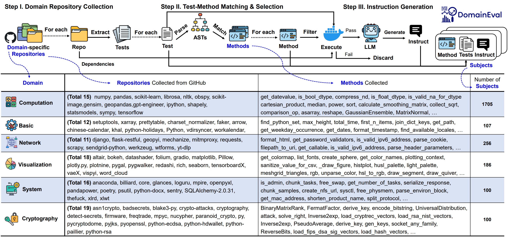

<p align="center">
<h1 align="center">DOMAINEVAL: An Auto-Constructed Benchmark for

 Multi-Domain Code Generation</h1>

<p align="center">
    <a href="https://domaineval.github.io/leaderboard.html"></a>
    <a href="https://arxiv.org/pdf/2408.13204"></a>
    <a href="https://benchmark.icip.org.cn/competitions/46"></a>
</p>

## Benchmark Description

DOMAINEVAL is an auto-constructed benchmark for multi-domain code generation that consists of 2k+ subjects (i.e., description, reference code and tests) covering six domains (i.e., Computation, Basic, Network, Cryptography, Visualization, System).



## Environment Setup
```bash
cd DomainEval/setup

env_name="your env name"
conda create -n "$env_name" python=3.9 -y
conda activate "$env_name"
conda install pytorch torchvision torchaudio pytorch-cuda=12.1 -c pytorch -c nvidia -y
pip install -r requirements_py39.txt
```

## Benchmark Construction

### Domain Repository Collection

Move the code repository to the path directory of the corresponding domain `{src_data}/{domain}`.

### Test-Method Matching & Selection
```bash
domain="your domain"
version="your version"
srcdata_dir="{src_data}"

cd DomainEval
mkdir "log_${version}"
nohup python -u sandbox.py \
--domain "$domain" \
--srcdata_dir "$srcdata_dir" \
--output_dir "bench_${version}" \
> "log_${version}/result_sandbox_${domain}.txt" &
python -u codefilter.py \
--bench_dir "bench_${version}" \
> "log_${version}/result_codefilter.txt"
```
### Instruction Generation
```bash
version="your version"
nohup python -u datagenerate.py \
--eval_dir "domaineval_${version}" \
> log_${version}/result_datagenerate.txt &
```

## Dataset

The final data is in `domaineval_{your version}`.
The data is in the format of json, each line is a json object, the format is:
```json
{
    "method_name":,
    "full_method_name":,
    "method_path":,
    "method_code":,
    "test_code_list":[
        {"test_code":, "code_start":, "test_path":},
        {"test_code":, "code_start":, "test_path":}
    ],
    "instruction":,
    "method_code_mask":,
}
```

## Evaluation
First, you need include the path and name of your model in `self.model_path_dict` within `modeleval.py`
and add your model api in `get_message` within `utils/utils_chat.py` and `self.model_name_list_api` within `modeleval.py`.

```bash
model_name="your model name or std"

# set the k in pass@k, it can only be 1 or 5 currently
k_pass=1 # or k_pass=5

# set the version of the dataset
version="your version"
eval_dir="domaineval_${version}"

# model inference
nohup python -u modeleval.py \
-m "$model_name" \
-b "$eval_dir" \
-k "$k_pass" \
> "result_modeleval_${model_name}_pass\@${k_pass}.txt" &

# result execution and analysis
nohup python -u resultexec.py \
-m "$model_name" \
-v "$eval_dir" \
-k "$k_pass" \
> result_exec.txt &
resultexec_pid=$!
echo $resultexec_pid
wait $resultexec_pid
mkdir -p "analyseresult/pass@${k_pass}"
python resultanalyse.py \
-m "$model_name" \
-v "$eval_dir" \
-k "$k_pass" \
> "analyseresult/pass@${k_pass}/result_analyse_${model_name}.txt"
```

Tips: 
To evaluate LLMs using the `domaineval_20240711` dataset, first set `model_name="std"`, `k_pass=1`, and `version="20240711"`, then run the commands in `Evaluation` to verify the environment. With a correctly installed environment, the accuracy of `std` should be 100%, with the only possible failure being a `timed out` error. You can also use our `setup/Dockerfile` to build the execution docker, but be aware that two data points might time out.

## Submission

Now you have the results of your model on the dataset.

- `DomainEval/modelresult/${eval_dir}/${model_name}/pass_${k_pass}`: Completed code generated by your LLM.
- `DomainEval/executeresult/${eval_dir}/${model_name}/pass_${k_pass}`: Execution results of the generated code.
- `DomainEval/analyseresult/pass@${k_pass}/result_analyse_${model_name}.txt`: Analysis results of the generated code.

The next step is to submit a pull request for the project:

1. [Fork](https://help.github.com/articles/fork-a-repo/) the repository into your own GitHub account.
2. [Clone](https://docs.github.com/en/repositories/creating-and-managing-repositories/cloning-a-repository) the repository to your local.
3. Checkout a new branch from main.
4. Make the results directories above (i.e. `./modelresult/${eval_dir}/${model_name}`, `./executeresult/${eval_dir}/${model_name}`, `./analyseresult/pass@${k_pass}/result_analyse_${model_name}.txt`).
5. Submit the Pull Request.
6. The maintainers will review your Pull Request soon.

Once your pull request is accepted, we will update the [Leaderboard](https://domaineval.github.io/leaderboard.html) with your results.

Tips: 
You can also try [Codabench](https://benchmark.icip.org.cn/competitions/46), which we provide, to evaluate model inference results. Currently, we only support calculating the pass@1 results for a single model with a sampling count of N=1. Please do not submit results from multiple models simultaneously.
